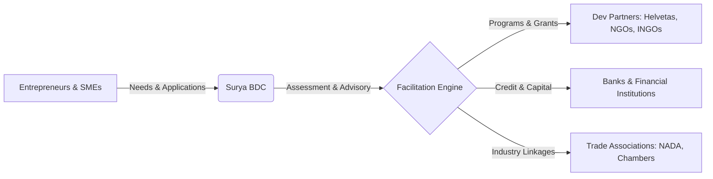

<p align="center">
  
</p>

<p align="center">
  
  
  
  
  
  
  
</p>

---

# Surya Business Development Center (SBDC) Web Portal

> **EMPOWERING BUSINESS. BUILDING FUTURES.**  
> Official corporate portal, enterprise impact platform, and structured business-facilitation gateway for **Surya Business Development Center Pvt. Ltd.** (Estd. 2083 B.S.), headquartered in **Birgunj, Parsa, Madhesh Province, Nepal**.

---

## 🌟 1. Corporate Overview & Operating Model

**Surya Business Development Center Pvt. Ltd. (SBDC)** is an independent enterprise facilitation, institutional advisory, and capacity-building firm registered under the Company Act 2063 (Office of the Company Registrar, Government of Nepal).

Operating as an ecosystem catalyst from Birgunj—the industrial and commercial heart of Nepal—SBDC bridges the critical gap between grassroots entrepreneurs, MSMEs, development partners, financial institutions, and government authorities.



### Core Operating Principle

> [!IMPORTANT]
> **Facilitation & Mediation Mandate:**  
> SBDC is **not** a direct lender, deposit-taking entity, or grant-issuing foundation. SBDC evaluates enterprise requirements, audits business viability, prepares investment/program dossiers, and connects qualified enterprises with appropriate external institutions (banks, development agencies, vocational training bodies, and government schemes). All financing and selection decisions remain at the sole discretion of those respective institutions.

---

## 🏛️ 2. Core Service Pillars & Service Areas

### The 5 Core Pillars

1. **Business Support & Advisory** – Strategic counsel, formalization, diagnostic audits, and business planning for startups and growing enterprises.
2. **Training & Capacity Building** – Practical, sector-specific skill development, leadership bootcamps, and vocational upgrades.
3. **Market Linkage & Networking** – Connecting local producers and service providers to provincial, national, and cross-border trade networks.
4. **Access to Finance & Facilitation** – Assisting businesses in meeting bank eligibility, preparing loan dossiers, and accessing non-dilutive grant windows.
5. **Technology & Digital Enablement** – Guiding digital transformation, cloud adoption, enterprise management tools, and online visibility.

### 9 Specialized Service Areas

- Business Incubation & Acceleration
- Financial & Investment Readiness
- Enterprise Strategy & Planning
- Digital Transformation & Tech Enablement
- Market Research & Growth Roadmaps
- Workforce & Leadership Training
- Supply Chain & Value Chain Optimization
- Institutional Alliances & Partnership Matchmaking
- Regulatory Navigation & Compliance Advisory

---

## 🔄 3. The 6-Stage Operational Methodology

SBDC utilizes a structured, audit-ready 6-stage lifecycle to deliver consistent results for enterprises:

```
[01 Understand] ──> [02 Assess] ──> [03 Plan] ──> [04 Implement] ──> [05 Document] ──> [06 Improve]
```

1. **Understand** – Comprehensive intake of enterprise objectives, challenges, and aspirations.
2. **Assess** – In-depth evaluation of operational, financial, and regulatory standing.
3. **Plan** – Developing an actionable, phased roadmap tailored to verified opportunities.
4. **Implement** – Active facilitation, training execution, and institutional matchmaking.
5. **Document** – Structured reporting, milestone tracking, and compliance record-keeping.
6. **Improve** – Post-intervention review, impact evaluation, and ongoing mentorship.

---

## 🚀 4. Key Pages & Platform Features

| Page Route                | Description                         | Key Highlights                                                                                                                             |
| :------------------------ | :---------------------------------- | :----------------------------------------------------------------------------------------------------------------------------------------- |
| **`/` (Home)**            | Primary corporate gateway           | Dynamic hero with brand banner, 5 service pillars, 6-stage methodology, verified impact metrics, partner highlights, and founders' quotes. |
| **`/about`**              | Institutional identity & governance | Corporate history (Estd. 2083 B.S.), core values, Birgunj headquarters profile, and detailed leadership bios.                              |
| **`/services`**           | Complete services breakdown         | Direct navbar navigation link detailing all 5 service pillars and 4 opportunity tracks.                                                    |
| **`/submit-requirement`** | Business intake gateway             | Multi-step interactive requirement submission form generating instant unique tracking IDs (e.g., `SBDC-2026-XXXXXX`).                      |
| **`/projects`**           | Case studies & initiatives          | Filterable portfolio of community, enterprise, and institutional engagements.                                                              |
| **`/activities`**         | Events & workshops calendar         | Timeline of conducted and upcoming capacity-building programs, conferences, and stakeholder forums.                                        |
| **`/impact`**             | Evidence-based outcomes             | Impact statistics, regional enterprise reach, and verified success stories.                                                                |
| **`/gallery`**            | Visual archive                      | Curated photo gallery of on-ground workshops, field visits, and formal ceremonies with lightbox modal.                                     |
| **`/contact`**            | Official inquiry portal             | Direct contact channels, Google Maps location, interactive message form, and official WhatsApp integration.                                |
| **Legal Pages**           | Regulatory transparency             | Dedicated pages for [Disclaimer](/disclaimer), [Privacy Policy](/privacy-policy), and [Terms of Service](/terms-of-service).               |

---

## 👥 5. Executive Leadership & Governance

- **Atul Raut** – _Founder & Director_  
  Leading enterprise advisory, market linkages, and strategic partner matchmaking for emerging startups and established SMEs across Nepal.  
  _Expertise:_ Business Advisory, Funding Facilitation, Market Access.

- **Minakshi Nanda** – _Head of Operations & Business Development_  
  Spearheading strategic vision, governance, and institutional collaboration to expand enterprise support and economic development initiatives.  
  _Expertise:_ Strategic Governance, Institutional Alliances, Enterprise Development.

- **Rohit Srivastava** – _CTO – Head of Technology and Digital Operations_  
  Architecting digital platforms, enterprise technology solutions, and streamlined digital facilitation tools for scalable business support.  
  _Expertise:_ Digital Transformation, Cloud Architecture, Enterprise Tech.

---

## 🤝 6. Strategic Partners & Institutional Collaborations

SBDC collaborates with national and international development partners, industry associations, and local stakeholders to drive sustainable enterprise development:

- **Helvetas Nepal** – Collaborative capacity building and skills development programs.
- **NADA Automobiles Association of Nepal (Madhesh Pradesh)** – Institutional automotive and enterprise sector engagement.
- **Local Chambers of Commerce & Industry** – Grassroots trade facilitation across Madhesh Province.

---

## 🎨 7. Brand Design System

The platform is designed around the **60-30-10 Rule** with rich visual tokens:

| Color Token      | HEX Value | RGB                  | Role in Interface                              |
| :--------------- | :-------- | :------------------- | :--------------------------------------------- |
| **Brand Orange** | `#F36A21` | `rgb(243, 106, 33)`  | Primary brand highlights, active buttons, CTAs |
| **Deep Orange**  | `#D95516` | `rgb(217, 85, 22)`   | Hover transitions, gradient accents            |
| **Deep Maroon**  | `#3B1113` | `rgb(59, 17, 19)`    | Authority headers, Stats bar, Footer           |
| **Maroon Light** | `#8A3A3A` | `rgb(138, 58, 58)`   | Accent borders and subtle dividers             |
| **Warm White**   | `#FFFDFC` | `rgb(255, 253, 252)` | Portal background canvas                       |
| **White**        | `#FFFFFF` | `rgb(255, 255, 255)` | Elevated cards and modal surfaces              |
| **Neutral Gray** | `#F3F4F6` | `rgb(243, 244, 246)` | Alternating section stripes                    |

- **Typography**: Clean, professional layout powered by Google Font **Plus Jakarta Sans**.
- **Iconography**: Clean, lightweight icons powered by **Lucide React** (`lucide-react`) and authentic brand icons via **React Icons** (`react-icons/fa6` for WhatsApp, etc.).

---

## 💻 8. Technology Stack

<p align="center">
  
  
  
  
  
  
</p>

<p align="center">
  
  
  
  
  
  
  
  
  
</p>

| Category                   | Technologies & Tools                                                                                                           |
| :------------------------- | :----------------------------------------------------------------------------------------------------------------------------- |
| **Core Framework**         | [Next.js 15](https://nextjs.org/) (App Router, Server & Client Components)                                                     |
| **UI Library**             | [React 19](https://react.dev/)                                                                                                 |
| **Language**               | [TypeScript](https://www.typescriptlang.org/) (Strict Mode)                                                                    |
| **Styling & Design**       | [Tailwind CSS v4](https://tailwindcss.com/) with `@tailwindcss/postcss`, [Figma](https://figma.com) Tokens                     |
| **Iconography**            | [Lucide React](https://lucide.dev/) & [React Icons](https://react-icons.github.io/react-icons/) (`FaWhatsapp`)                 |
| **Runtime & Tooling**      | [Bun](https://bun.sh/), [Node.js](https://nodejs.org/), [npm](https://npmjs.com), [Git](https://git-scm.com), ESLint, Prettier |
| **Communication & Deploy** | WhatsApp Direct Integration, [Vercel](https://vercel.com) Edge Deployment                                                      |

---

## 🛠️ 9. Getting Started & Development

### Prerequisites

- **Bun** v1.0+ (recommended) or **Node.js** v20+

### 1. Installation

```bash
# Clone the repository
git clone <repository-url>
cd suryabdc-portal

# Install dependencies
bun install
# or: npm install
```

### 2. Run Development Server

```bash
bun run dev
# or: npm run dev
```

Open [http://localhost:3000](http://localhost:3000) in your browser.

### 3. Production Build & Linting

```bash
# Verify TypeScript & compile production bundle
bun run build
# or: npm run build

# Start production server
bun run start
# or: npm run start
```

### 4. Remote / Mobile Testing with ngrok

When testing the development server remotely or on mobile devices through an ngrok tunnel, include `--host-header=rewrite` to ensure Next.js handles WebSocket HMR smoothly:

```bash
ngrok http --host-header=rewrite 3000
```

---

## 📂 10. Repository File Structure

```
suryabdc-portal/
├── app/
│   ├── layout.tsx              # Root layout (Plus Jakarta Sans, Navbar, Footer, WhatsApp)
│   ├── globals.css             # Tailwind v4 theme definitions and custom classes
│   ├── page.tsx                # Corporate Homepage
│   ├── about/page.tsx          # Institutional profile, history, leadership team
│   ├── services/page.tsx       # 5 Service pillars, 9 service areas, opportunity types
│   ├── submit-requirement/     # Structured business requirement intake form
│   ├── projects/page.tsx       # Filterable projects and case studies
│   ├── activities/page.tsx     # Activity calendar & workshop records
│   ├── impact/page.tsx         # Verified impact metrics & outcomes
│   ├── gallery/page.tsx        # High-res photo gallery with lightbox modal
│   ├── contact/page.tsx        # Contact details, interactive message form, WhatsApp link
│   ├── disclaimer/page.tsx     # Facilitation & regulatory disclaimer
│   ├── privacy-policy/page.tsx # Corporate privacy policy
│   └── terms-of-service/       # Terms of service
├── components/
│   ├── layout/                 # Navbar, Footer, FloatingWhatsApp
│   ├── ui/                     # Logo, Button, Modal, Lightbox, Badges
│   └── home/                   # Hero, WhatWeDo, HowItWorks, FeaturedProjects, StatsBar, etc.
├── lib/
│   ├── constants.ts            # Brand meta, contact info (Birgunj), navigation links
│   └── data.ts                 # Service pillars, leadership team, projects, testimonials
├── public/
│   ├── favicon.png             # Official brand favicon
│   ├── logos/
│   │   ├── SuryaBDC-logo.png   # Primary square brand logo
│   │   └── SuryaBDC-banner.png # High-resolution corporate header banner
│   └── images/                 # Leadership headshots and verified gallery imagery
├── CHANGELOG.md                # Version release history and updates ledger
├── README.md                   # Platform documentation
├── next.config.ts              # Next.js server configuration
├── tsconfig.json               # TypeScript compiler rules
└── package.json                # Project scripts and dependencies
```

---

## 📄 11. Governance & Copyright

&copy; 2026 **Surya Business Development Center Pvt. Ltd.** All Rights Reserved.  
Headquarters: Birgunj, Parsa, Madhesh Province, Nepal.
